# Verity v2 — Technical Architecture Reference

> One-stop technical reference for engineers, architects, and governance reviewers.
> Covers system context, hub internals, harness image anatomy, cluster topology,
> enrollment lifecycle, package anatomy, deployment flow, runtime invocation,
> tool routing, run state machine, and supply chain.
>
> All diagrams are derived from the accepted ADR set (ADR-0002 through ADR-0018).

---

## Contents

1. [System Context — The Big Picture](#1-system-context)
2. [Hub Platform Internals](#2-hub-platform-internals)
3. [Harness Image Anatomy](#3-harness-image-anatomy)
4. [Harness Cluster Architecture](#4-harness-cluster-architecture)
5. [Cluster Enrollment & Provisioning Lifecycle](#5-cluster-enrollment--provisioning-lifecycle)
6. [Package Anatomy — `.vtx` and `.vax`](#6-package-anatomy)
7. [Package Deployment Flow](#7-package-deployment-flow)
8. [Runtime Invocation — End-to-End](#8-runtime-invocation)
9. [Tool Call Routing](#9-tool-call-routing)
10. [Run Lifecycle State Machine](#10-run-lifecycle-state-machine)
11. [Supply Chain — Build to Deploy](#11-supply-chain)

---

## 1. System Context

> **What it shows:** the three operating zones, the three personas, and the main
> communication paths between them. No internal detail.

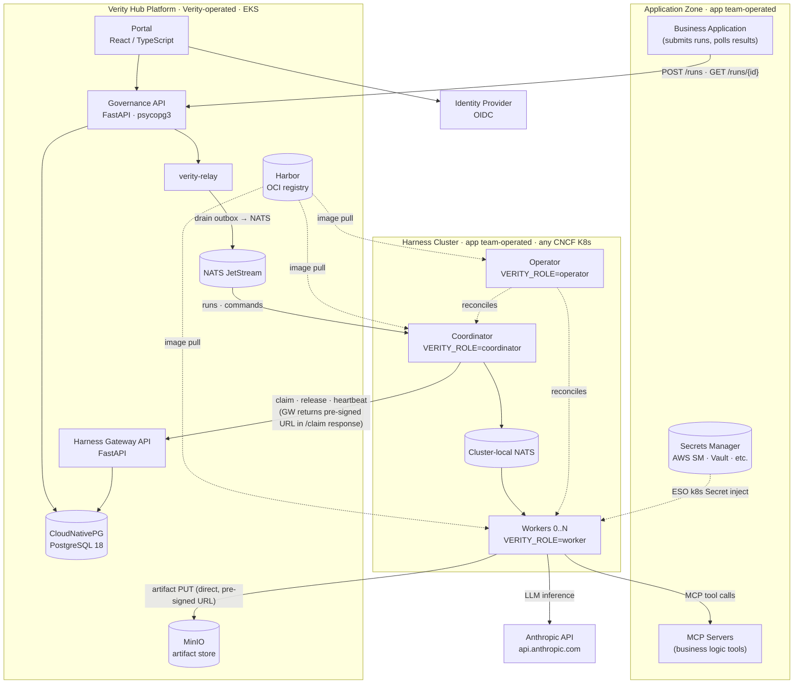

### Explanation

**Three operating zones** reflect three distinct ownership boundaries.

**Verity Hub Platform** (Verity-operated, EKS) is the governance system of record. It
holds the governance database (CloudNativePG/PostgreSQL), the artifact object store
(MinIO), the OCI image registry (Harbor), the NATS dispatch broker, and the two API
surfaces the outside world talks to: the Governance API (for applications and the portal)
and the Harness Gateway API (for the coordinator — the harness's sole hub uplink).

**Harness Cluster** (app team-operated, any CNCF K8s) runs inside the customer's
infrastructure. Verity ships the image and the Helm chart; the customer's infra team
provisions the substrate and the app team installs the operator. The cluster contains
three roles of a single Docker image (one image, role by config): the **Operator**
(manages k8s Deployments, holds RBAC), the **Coordinator** (claims runs, directs
workers, relays status), and the **Workers** (execute the LLM agent loop).

**Application Zone** holds the business application that submits work to Verity, the
MCP servers that implement the application's business-logic tools, and the secrets
manager from which connector credentials are injected at runtime.

**Solid arrows** are data flows (REST calls, NATS messages, object store writes). **Dashed
arrows** are management or infrastructure relationships (k8s reconciliation, image pulls,
secret injection). The hub is never in the hot path for LLM calls, tool calls, or
connector I/O — those all happen inside the worker without a hub hop.

---

## 2. Hub Platform Internals

> **What it shows:** the components inside the Hub Platform and how they connect to
> each other and to external callers.

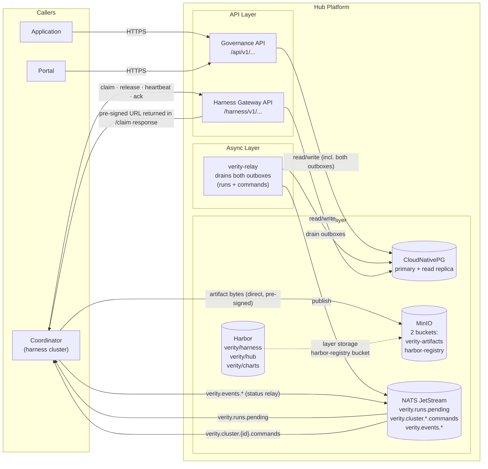

### Explanation

The hub is internally organized into three layers.

**API Layer** — two distinct REST surfaces with different security contexts and
different callers. The **Governance API** is the portal and application-facing surface:
it handles intake, applications, packages, deployment commands, run submissions, and
polling. The **Harness Gateway API** is the harness-facing surface: it handles claim,
release, heartbeat, enrollment, and pre-signed URL grants. These are separate FastAPI
applications; the Gateway API has a stricter, more minimal surface because the harness
is a Verity-published client whose behavior is known.

**Async Layer** — `verity-relay` is a background process (CronJob, ~60 s sweep) that
drains two outbox tables from Postgres: `run_dispatch_outbox` (pending runs to publish
to NATS) and `harness_command_outbox` (deploy/patch/cert commands to push to cluster
command subjects). The outbox pattern is the durability guarantee: a run is written to
Postgres in a single transaction alongside its outbox row, so no run can be lost between
API commit and NATS delivery even if the relay crashes.

**Data Layer** — four persistence services.
- **CloudNativePG** is the governance system of record (primary + read replica + PITR).
  All mutable state — applications, intakes, runs, dispatch records, packages,
  deployments — lives here.
- **NATS JetStream** is the dispatch broker. It has three subject families: pending-run
  fan-out (`verity.runs.pending`), per-cluster command delivery
  (`verity.cluster.{id}.commands`), and run event relay (`verity.events.{run_id}`).
- **MinIO** (S3-compatible) holds two buckets: `verity-artifacts` for per-run log
  artifacts (decision JSON, JSONL invocation logs, error payloads), and `harbor-registry`
  for Harbor's image layer storage. These are separate concerns sharing one service.
- **Harbor** is the OCI image registry. It stores the harness image, the operator image,
  the hub image, and Helm charts as OCI artifacts. Harbor itself uses the MinIO
  `harbor-registry` bucket for layer storage and CloudNativePG for its metadata database —
  two fewer services to operate.

---

## 3. Harness Image Anatomy

> **What it shows:** the internal structure of the single harness Docker image — its
> base OS, the layered components baked in, and how the three roles are activated.

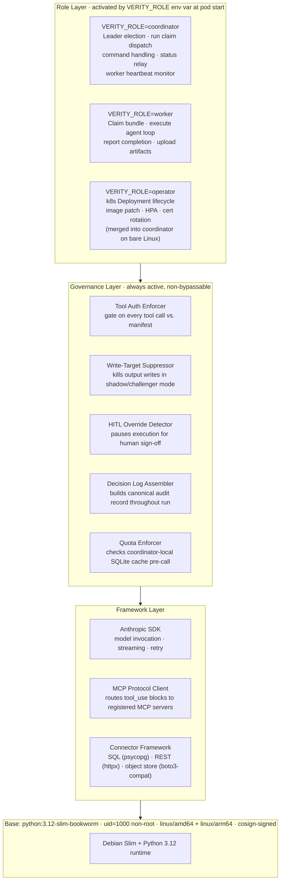

### Explanation

The harness ships as **one Docker image** that runs in three different roles determined
by the `VERITY_ROLE` environment variable. This keeps the supply chain simple: one image
digest to sign, one image to scan, one compatibility matrix to maintain. Role separation
is a runtime configuration concern, not a build concern.

**Base Layer** — `python:3.12-slim-bookworm` (Debian Slim). Alpine is rejected because
musl libc causes runtime failures with psycopg and the cryptography library. The image
runs as a non-root user (`uid=1000`) satisfying OpenShift admission controllers and
enterprise security baselines without per-cluster configuration. The image is built for
both `linux/amd64` and `linux/arm64` (Docker buildx multi-arch) to support EKS Graviton
nodes and Apple Silicon developer laptops. Every published image is signed with cosign;
the signature is stored as an OCI referrer artifact in Harbor alongside the image digest.

**Framework Layer** — the three protocol clients the harness needs to do its job.
The **Anthropic SDK** drives all Claude model invocations (completions, streaming,
tool-use). The **MCP Protocol Client** is a protocol router: when Claude generates a
`tool_use` block for a Category A (application-side) tool, the client forwards the call
over the MCP protocol to the registered MCP server, waits for the result, and returns it
to Claude. The **Connector Framework** implements Category B (standard) tools: SQL
queries via psycopg, REST calls via httpx, and object store reads via S3-compatible API.
The connector type available in a given run is fixed at the image digest — connectors are
baked in, not dynamically loaded, so audit replay on the same image digest means exactly
the same connector behaviour.

**Governance Layer** — five components that run on every **worker**, always active, and
non-bypassable by package code or model behaviour. The `coordinator` and `operator` roles
do not activate the governance layer — they operate entirely within the framework and base
layers. The arrows in the diagram show image composition order, not per-role activation.
- **Tool Authorization Enforcer** checks every `tool_use` block against the package's
  `tool_authorizations` manifest before any network call is made. If the tool is not
  declared, the harness returns an authorization error to Claude and does not execute it.
  A model cannot be prompted into calling an unauthorized tool.
- **Write-Target Suppressor** enforces the shadow/challenger lifecycle constraint: when a
  package is deployed in shadow or challenger mode, all Target Binding write operations are
  suppressed before execution, producing zero business-system side effects. Champion and
  deprecated packages have writes enabled.
- **HITL Override Detector** monitors execution for configured human-in-the-loop
  thresholds. When triggered, it pauses the execution loop and waits for a human override
  decision through the governance portal before proceeding.
- **Decision Log Assembler** accumulates the canonical per-run governance record
  throughout execution — all model invocations, tool calls, tool results, and the final
  output — and writes `decision_log.json` to the object store on completion.
- **Quota Enforcer** checks against the coordinator's local SQLite quota cache before
  each model call. The quota cache is an operational cache; the hub is authoritative and
  refreshes it on reconnect.

**Role Layer** — the three processes activated by `VERITY_ROLE`:
- **coordinator** manages run dispatch for the cluster: it consumes NATS messages,
  claims runs via the Gateway API, dispatches jobs to workers via cluster-local NATS,
  monitors worker heartbeats, relays status back to the hub in 200 ms batches, and holds
  the cluster's heartbeat lease (leader election among standby coordinators).
- **worker** executes a single claimed run: pulls the package bundle from the local cache,
  instantiates the agent loop, calls Claude, routes tool calls through the governance and
  framework layers, assembles the decision log, uploads artifacts to MinIO via pre-signed
  URL, and reports completion to the coordinator.
- **operator** manages the Kubernetes control plane for the harness namespace: reconciles
  Coordinator and Worker Deployments to desired state from hub commands, handles image
  patch, HPA configuration, and cert rotation. On bare Linux the operator's functions
  collapse into the coordinator (there is no k8s API).

---

## 4. Harness Cluster Architecture

> **What it shows:** what is deployed inside the harness Kubernetes namespace, how
> many instances of each component run, what k8s resources they use, and how
> components communicate.

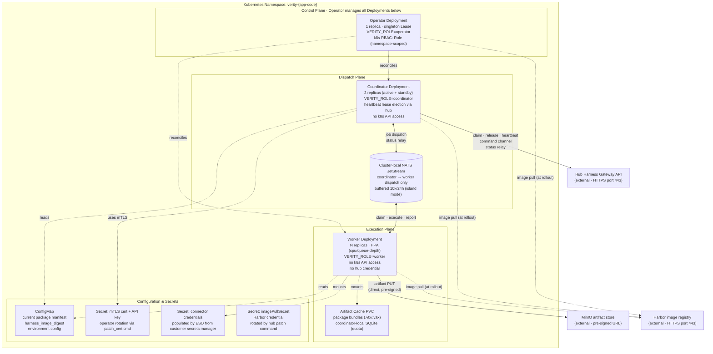

### Explanation

All harness components run in a single dedicated Kubernetes namespace
(`verity-{app-code}`). The namespace is created by `helm install`; everything inside it
is reconciled by the Operator autonomously thereafter.

**Operator Deployment** (1 replica, singleton Kubernetes Lease for HA) is the only
component with k8s API access. It holds a namespace-scoped `Role` (not `ClusterRole`)
with just enough permissions to manage `Deployments`, `HorizontalPodAutoscalers`,
`ConfigMaps`, and `Secrets`. It never touches customer data or calls the model. A
compromised worker cannot escalate to the operator's RBAC because they are different
`ServiceAccounts` with no `RoleBinding`.

**Coordinator Deployment** (2 replicas: 1 active, 1 standby) is the cluster's sole hub
uplink. Only the active coordinator holds the heartbeat lease (won by an atomic SQL
`UPDATE … WHERE lease_expires_at < now()` at the Gateway API). The standby waits and
wins the lease within the lease duration (~6 min default, 3 min average failover) if the
active coordinator dies. During failover, **in-flight worker jobs continue uninterrupted**
— workers hold their own claim and execute independently. Only new dispatch pauses until
a new coordinator wins the lease. The coordinator holds the mTLS cert and API key;
workers never hold a hub credential.

**Worker Deployment** (N replicas, scaled by HPA on CPU/queue depth) are stateless
execution units. Each worker processes one claimed run at a time — the agent loop,
LLM calls, tool calls, and artifact upload are all local to the worker. Workers
communicate with the coordinator exclusively via cluster-local NATS; they never make
direct outbound calls to the hub. Workers do make direct outbound calls to the Anthropic
API and MCP servers (no hub hop on the execution hot path).

**Cluster-local NATS** is an in-cluster NATS JetStream instance used only for
coordinator–worker dispatch. It is not the same NATS as the hub's dispatch broker.
Its purpose is twofold: fast local dispatch (coordinator → workers), and island-mode
buffering (event messages accumulate here when the hub is unreachable, up to 10,000
events / 24 hours, and are replayed on reconnect).

**Artifact Cache PVC** is a persistent volume claim mounted by workers. It holds
downloaded and SHA-256-verified package bundles (`.vtx`/`.vax` files). The
`deploy_package` command populates this cache; workers load the bundle at claim time.
Old and new bundles coexist in the cache — in-flight jobs finish on the bundle they
started with, enabling zero-downtime package swaps.

**Secrets** follow two patterns. The mTLS cert and API key (`SEC_M`) are delivered
by Verity's enrollment flow and rotated via hub `patch_cert` commands. Connector
credentials (`SEC_C`) are the customer's own secrets: their values live in the
customer's secrets manager and are injected into worker pods at startup via External
Secrets Operator (ESO), which the infra team configures. Verity never sees the values
— the hub stores only the credential name and verification status.

---

## 5. Cluster Enrollment & Provisioning Lifecycle

> **What it shows:** the five-step sequence from "I have a Kubernetes cluster" to
> "actively running governed AI workloads." Actors: app team, infra team (prerequisite),
> and Verity portal.

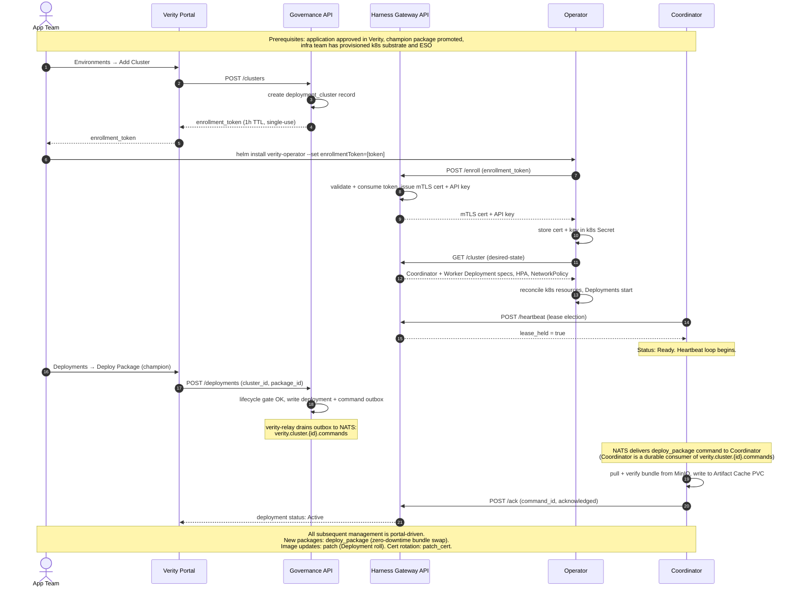

### Explanation

**Step 1 — Register the cluster in the portal.** The app team navigates to the
application's Environments & Deployments page and adds a new cluster, associating it
with a specific environment (non-prod or prod). The Governance API mints a
**single-use enrollment token** with a 1-hour TTL. The token is a one-time secret: once
exchanged in step 3, it is consumed and cannot be reused.

**Step 2 — Install the operator.** The app team runs a single `helm install` command
with the enrollment token. This is the **only** time they need a helm command after day
one.

**Step 3 — Token exchange.** On first startup, the operator calls the Harness Gateway
API with the enrollment token. The Gateway validates it, creates a unique mTLS
certificate and app-scoped API key for this cluster, and returns them. The token is
consumed atomically. The operator stores the cert and key in a k8s Secret. All
subsequent outbound traffic from the cluster is mTLS-authenticated on port 443 — zero
inbound ports are required.

**Step 4 — Operator reconciliation.** The operator fetches the desired cluster
configuration from the Gateway and reconciles it: Coordinator Deployment (2 replicas),
Worker Deployment (N replicas + HPA), NetworkPolicy, ConfigMaps, and ServiceAccounts.
The coordinator pods start and begin heartbeating; the active coordinator wins the
heartbeat lease. Cluster status becomes **Ready**.

**Step 5 — Deploy champion package.** The app team deploys a champion package from the
portal. The Governance API validates the lifecycle→environment gate (champion can deploy
anywhere), records the deployment, and places a `deploy_package` command in the
`harness_command_outbox`. `verity-relay` drains the outbox to NATS; the coordinator
consumes the command, pulls the bundle from MinIO, verifies the SHA-256 hash, and caches
it locally. Cluster status becomes **Active**. The cluster is now executing governed AI
workloads.

**Ongoing management** is entirely portal-driven and involves no Helm commands. New
package versions use `deploy_package` (zero-downtime bundle swap — in-flight jobs
finish on the old bundle). Harness image updates use `patch` (Deployment roll — graceful
drains or force, configurable). Certificate rotation uses `patch_cert` (7-day overlap
window, no downtime).

---

## 6. Package Anatomy

> **What it shows:** the structure of a `.vtx`/`.vax` package manifest, the lifecycle
> state machine, and the deployment envelope.

### 6a. Package Manifest Structure

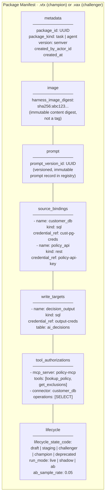

### 6b. Package Lifecycle State Machine

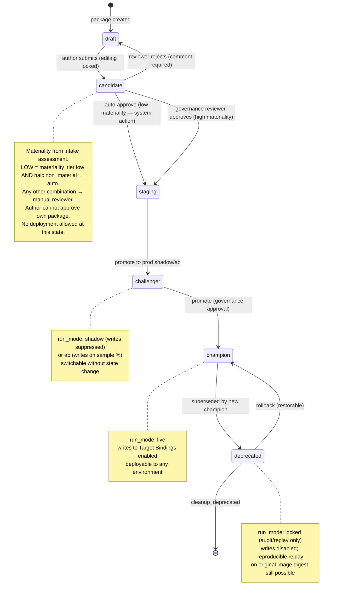

### 6c. Environment Deployment Matrix

| Lifecycle State | Non-Prod Clusters | Prod Clusters | Writes Enabled |
|---|---|---|---|
| `draft` / `candidate` | ✗ | ✗ | — |
| `staging` | ✓ | ✗ | Non-prod only |
| `challenger` | ✓ | ✓ (shadow or A/B) | Suppressed (shadow) / scoped (A/B) |
| `champion` | ✓ | ✓ | ✓ |
| `deprecated` | ✓ (replay) | ✓ (replay) | ✗ (audit/replay only) |

### Explanation

**One image, many packages.** The `harness_image_digest` field binds the package to an
exact harness image by SHA-256 content hash — not a mutable tag. This is the foundation
of reproducible audit replay: to re-run a deprecated package, spin up an ephemeral
cluster with the original image digest and the original decision-log data. The output is
byte-for-byte reproducible because the model, the connectors, the prompts, and the tools
are all fixed.

**Source bindings and write targets** declare what the package is allowed to read and
write. They reference named credentials (stored in the customer's secrets manager) by
logical name, not by value. The connector framework resolves the binding at claim time
and uses the injected k8s Secret for the actual connection.

**Tool authorizations** are the input to the Tool Authorization Enforcer in the
governance layer. A `tool_use` block from Claude that is not in this list is refused
before any network call — the enforcer is a non-bypassable gate.

**Lifecycle state** is the governed deployment state machine. A package progresses from
authoring (`draft`) through non-prod testing (`staging`) to production shadow/A-B
testing (`challenger`) and finally to live production (`champion`). Lifecycle transitions
are recorded by the Governance API as insert-only audit records. The `deprecated` state
is restorable to `champion` (rollback), enabling production incidents to be resolved
without re-authoring.

---

## 7. Package Deployment Flow

> **What it shows:** the sequence from a portal deploy action to an active package
> running on a cluster.

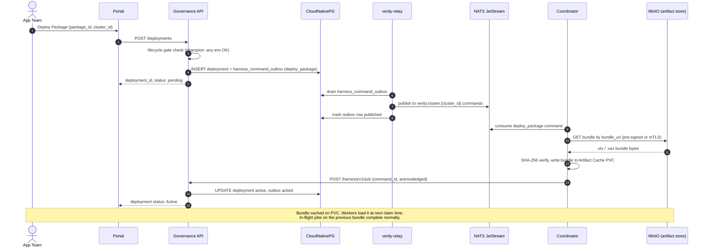

### Explanation

Package deployment is **zero-downtime** because the package bundle is loaded at claim
time, not at pod startup. When the coordinator caches a new bundle, workers that are
currently executing their agent loop finish on the old bundle. Workers that claim a new
run after the bundle is cached load the new bundle. Old and new bundles coexist in the
artifact cache PVC.

The **lifecycle gate** at step 3 is a hard check enforced by the Governance API: a
`staging` package cannot be deployed to a prod cluster; a `draft` cannot be deployed
anywhere. This is the control-plane enforcement of the state→environment matrix from
ADR-0006.

The **transactional outbox** (step 4) ensures the command cannot be lost: the deployment
record and the command outbox row are written in a single Postgres transaction. If
`verity-relay` crashes before publishing, it will drain the outbox on the next sweep.
The coordinator's `ack` in step 11 closes the loop and allows the portal to show the
cluster as Active.

**`deploy_package` vs. `patch`** — this flow handles bundle swaps. Image updates (when
a new harness image version is released) follow a different command type (`patch`) which
triggers the **operator** to roll the Coordinator and Worker Deployments. That is a pod
restart cycle (graceful or force), not a hot swap.

---

## 8. Runtime Invocation — End-to-End

> **What it shows:** the complete lifecycle of a single run from application submission
> to result polling, including the dispatch pipeline, worker execution, artifact upload,
> and the polling contract.

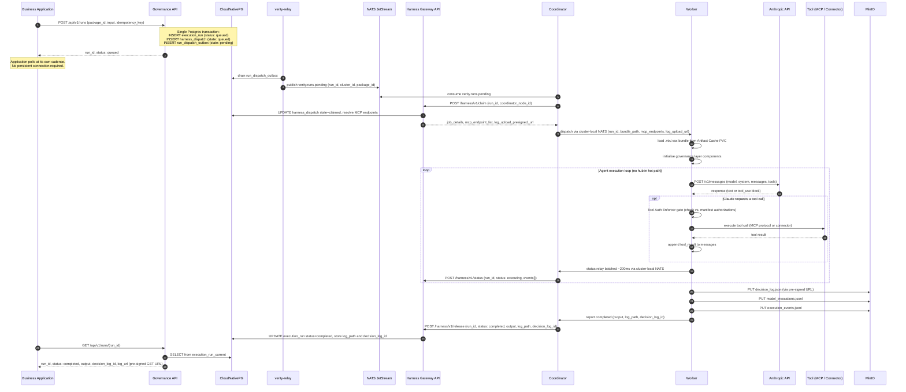

### Explanation

**Phase 1 — Submission (steps 1–3).** The application POSTs a run to the Governance
API with an idempotency key. The API writes three records in a single Postgres
transaction: `execution_run` (the authoritative run record), `harness_dispatch` (the
mutable current state of dispatch), and `run_dispatch_outbox` (the pending NATS
publish). The transaction guarantees that no run can be lost: if `verity-relay` crashes
between the commit and the NATS publish, the outbox row remains `pending` and the relay
will republish it on its next sweep (60 s). The API returns immediately with
`status: "queued"`. The application does not block; it polls.

**Phase 2 — Dispatch (steps 4–9).** `verity-relay` drains the outbox to NATS. The
coordinator is a durable consumer of `verity.runs.pending`. When it receives the
message, it calls the Gateway API to **claim** the run — an atomic SQL `UPDATE` that
prevents two coordinators from double-claiming. The Gateway resolves the MCP endpoint
list for this package and cluster (so the worker can call MCP servers without mid-run
registry lookups), and returns it alongside the pre-signed upload URL. The coordinator
dispatches to a worker via **cluster-local NATS** — the hub is not involved.

**Phase 3 — Execution (steps 10–14).** The worker loads the package bundle and runs the
agent loop. The **hub is entirely absent from this phase**: LLM calls go direct to
Anthropic, MCP tool calls go direct to the application's MCP servers, connector calls
go direct to the customer's data sources. The Tool Authorization Enforcer gates every
tool call synchronously before any network I/O. Status events are batched and relayed
to the coordinator every ~200 ms; the coordinator aggregates and forwards to the Gateway
in batches, keeping it out of the per-tool-call hot path.

**Phase 4 — Artifact upload and release (steps 15–20).** When the agent loop
terminates, the worker uploads three artifacts directly to MinIO using the pre-signed
PUT URL obtained at claim time (no bytes proxy through the hub). The `release` call
to the Gateway closes the run, stores the log path and decision log ID, and marks the
run completed in Postgres. The Gateway generates pre-signed download URLs on demand at
poll time — they are never stored.

**Phase 5 — Application polling (steps 21–23).** The application polls
`GET /api/v1/runs/{run_id}`. The Governance API reads from `execution_run_current` (the
live view backed by the primary + read replica). On completion, the response is **inline**
— output, `decision_log_id`, and a freshly-generated pre-signed `log_url` in one call.
The application does not need a separate result fetch.

**Hard failure handling** — if a worker dies hard (OOM kill, node loss), it writes
nothing. The coordinator detects the missed worker heartbeat and reports `job_lost` to
the Gateway. The application's next poll returns `status: failed, log_url: null`. If the
coordinator itself dies hard, the hub detects lease expiry and marks all in-flight runs
for the cluster as `failed` with `error_code: coordinator_timeout`. There is no
`error.json` for hard failures — that file is best-effort for graceful exits only.

---

## 9. Tool Call Routing

> **What it shows:** the three categories of tool implementations and how the worker
> routes a `tool_use` block from Claude through the correct execution path.

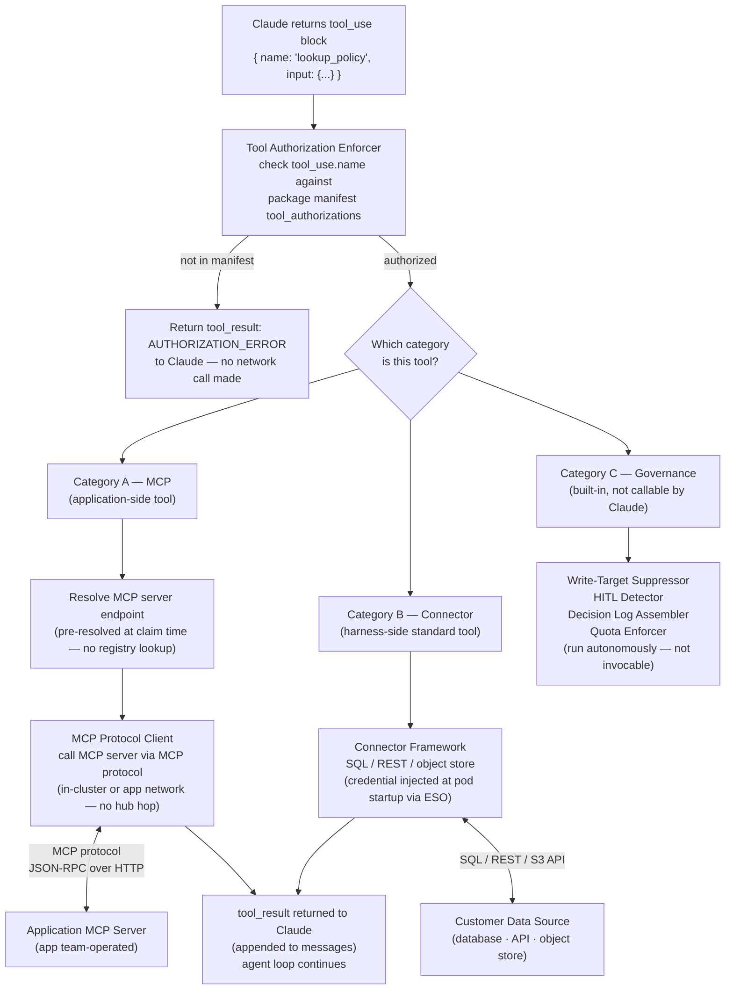

### Explanation

**Tool routing begins at the enforcement gate.** Before any network call, the Tool
Authorization Enforcer checks the `tool_use.name` against the `tool_authorizations`
section of the loaded package manifest. If the tool is not declared, the enforcer returns
a `tool_result` with an authorization error back to Claude. The model receives the error
and must decide how to proceed; the harness does not execute the tool regardless of what
the model requested. This is a non-bypassable security and governance control — the model
cannot be prompt-injected into calling an undeclared tool.

**Category A — Application-side MCP tools.** These are business-logic tools implemented
by the application team as MCP servers running alongside their application (e.g.
`lookup_policy`, `get_customer_profile`). The harness contains an MCP protocol client
that routes the call; it is a protocol router, not a tool implementer. The MCP server
endpoint was resolved at claim time (injected by the coordinator at dispatch), so the
worker holds a static endpoint map for the life of the run — no mid-run registry lookups,
no hub involvement. Traffic is in-cluster or within the application's network.

**Category B — Standard connectors (harness-side).** Common data access patterns —
SQL queries, REST API calls, object store reads — are implemented as a connector
framework baked into the harness image. The package's `source_bindings` and
`write_targets` declare which connectors are active and with which named credentials.
Credentials are injected as k8s Secrets by ESO at pod startup (never held by the hub).
The hub is not in the path for connector calls.

**Category C — Built-in governance tools.** These are not Claude-callable tools; they
are background components that run throughout the agent loop. They cannot be invoked via
`tool_use` and are not listed in `tool_authorizations`. They operate autonomously: the
Write-Target Suppressor checks every proposed write; the HITL Detector watches for
threshold triggers; the Decision Log Assembler accumulates the audit record; the Quota
Enforcer checks the SQLite cache before each model call.

---

## 10. Run Lifecycle State Machine

> **What it shows:** the full state lifecycle of a run, from the application's
> perspective (polling API states) and the internal dispatch record states.

### 10a. Application-visible states (polling API)

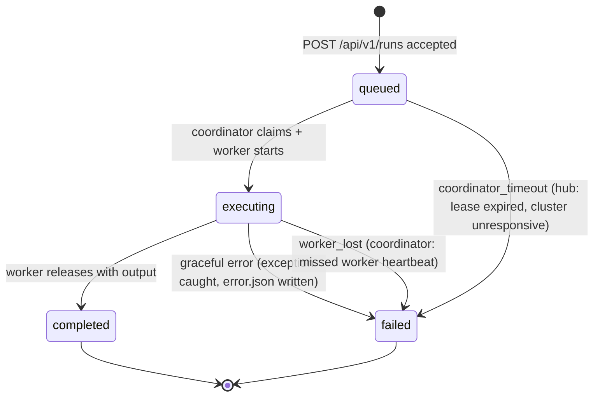

### 10b. Internal dispatch pipeline — two tables, one pipeline

> **Why two tables?** `run_dispatch_outbox` (OB) is a short-lived delivery guarantee:
> it only exists to survive a relay crash and get the message to NATS. Once NATS has the
> message, OB's job is done. `harness_dispatch` (HD) is the long-lived execution state
> tracker: it follows the run from creation all the way to completion or failure. They are
> written together in one transaction but serve different purposes and have different lifespans.

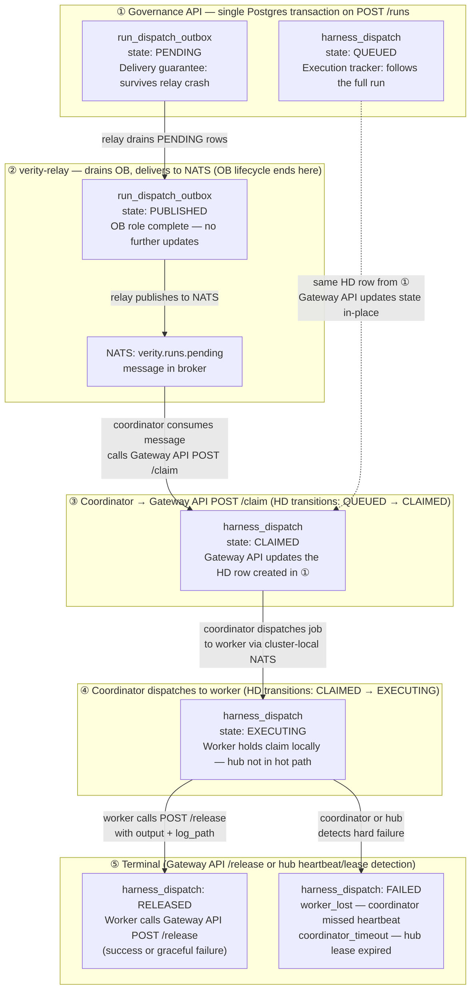

### Explanation

**Why there are two tables and not one** — the two tables answer different questions at
different points in time. `run_dispatch_outbox` answers a single question: *has this run
been successfully handed off to NATS?* It has two states (`PENDING`, `PUBLISHED`) and is
done the moment `verity-relay` delivers the message. Its only purpose is to make NATS
delivery durable: if the relay process crashes between the Governance API commit and the
NATS publish, the row stays `PENDING` and the relay republishes it on its next sweep.
Without this table a relay crash would silently drop runs. `harness_dispatch` answers a
different question: *what is the current state of this run's execution?* It starts at
`QUEUED` (same transaction as OB) and is updated at every execution milestone —
`CLAIMED`, `EXECUTING`, `RELEASED`, `FAILED` — all the way to the terminal state. It is
the live record that the application's poll reads through `execution_run_current`.

**They are born together** — step ① writes both rows in a single Postgres transaction.
No run can exist in `harness_dispatch` without a corresponding `run_dispatch_outbox` row,
and vice versa. This atomicity means there is no window where a run is "in HD but not in
OB" or "in OB but not in HD."

**OB exits the picture at step ②** — once `verity-relay` marks the row `PUBLISHED` and
NATS has the message, the outbox row is effectively inert. HD is now the only table
tracking the run.

**HD transitions are driven by different actors** — this is the key operational
distinction: the Governance API creates the HD row (`QUEUED`); the Harness Gateway API
updates it on every milestone (`CLAIMED`, `EXECUTING`, `RELEASED`, `FAILED`). The
Governance API never touches HD again after creation. The coordinator drives the claim
and release transitions (by calling the Gateway API); the hub's lease-expiry job drives
the `coordinator_timeout` failure transition autonomously.

**The `harness_dispatch` and `execution_run_status` audit record are always written in
the same transaction** at every state transition — they cannot drift. The idempotency key
the application provides at `POST /runs` guards against duplicate HD rows if the
application retries a timed-out submission.

---

## 11. Supply Chain — Build to Deploy

> **What it shows:** the CI/CD pipeline that takes a git commit to a signed, scanned
> image in Harbor, and then to enrolled clusters via the governance control plane.

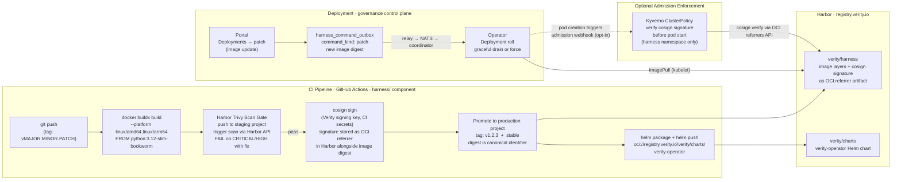

### Explanation

**Build** — `docker buildx build` with `--platform linux/amd64,linux/arm64` produces a
multi-arch manifest. Both platforms are built and pushed in a single step via Docker
buildx multi-arch manifests.

**Scan gate** — the image is pushed to a staging Harbor project and a Trivy scan is
triggered via the Harbor API. The pipeline blocks on scan completion. CRITICAL or HIGH
severity CVEs that have a known fix cause a hard pipeline failure — the image does not
proceed to signing or promotion. This is a build-time gate, not a post-publish advisory.

**Sign** — `cosign sign` is run with Verity's signing key (stored in the CI secrets
manager). Harbor stores the cosign signature as an **OCI referrer artifact** attached
to the signed image manifest — there is no side-channel storage; `cosign verify` works
directly against the Harbor referrers API. The image digest (SHA-256) is the canonical
identifier; the tag (`v1.2.3`, `stable`) is a human-readable alias.

**Promote** — the image is tagged and moved from the staging project to the production
`verity/harness` project in Harbor. The production project's retention policy keeps the
last N releases plus all `stable` tags.

**Helm chart** — the `verity-operator` Helm chart is packaged and pushed to
`oci://registry.verity.io/verity/charts/verity-operator`. Enrolled customers pull the
chart via `helm install`/`helm upgrade` using this OCI URL, or via Harbor's classic
`index.yaml` endpoint for clients that do not support OCI Helm.

**Deployment via governance** — when a new image version is ready, the Verity team (or
app team with permissions) triggers an image update from the portal. The Governance API
writes a `patch` command to `harness_command_outbox`. `verity-relay` drains it to
`verity.cluster.{id}.commands`. The coordinator forwards to the Operator. The Operator
performs a **Deployment roll** on the Coordinator and Worker Deployments — pulling the
new image digest from Harbor. The portal offers a graceful/force choice: graceful stops
accepting new dispatch and waits for in-flight jobs to complete; force restarts
immediately and requeues interrupted jobs.

**Admission enforcement (opt-in)** — for customers running Kyverno or OPA Gatekeeper,
Verity documents a recommended `ClusterPolicy` that verifies the cosign signature on any
pod scheduled in the `verity-*` namespace before it is allowed to start. This prevents
unsigned or externally-sourced images from running as the harness even if an attacker
substitutes an image reference. The policy is opt-in because CNI/admission controller
choice varies across customer clusters.

**Air-gap replication** — customers with air-gapped clusters configure a Harbor
replication rule from `registry.verity.io/verity/` to their internal Harbor instance.
Cosign signatures replicate alongside the image via Harbor's OCI referrers support.
Their local Kyverno policy verifies the Verity signing key against the replicated
signature. No Verity involvement is required after the replication rule is established.

---

## 12. Technology Stack Matrix

> **What it shows:** every technology choice in the platform, the layer it belongs to,
> the specific version or variant in use, and the architectural rationale.

### 12a. Hub Platform

| Layer | Technology | Version / Variant | Role & Rationale |
|---|---|---|---|
| **Portal** | React | 18+ | Component-based UI; pairs with Vite for fast dev builds |
| **Portal** | TypeScript | 5+ | Type safety across API boundary; field names mirror Pydantic models |
| **Portal** | Vite | 5+ | Build tool; fast HMR, ES module output |
| **Portal CSS** | Custom 5-layer CSS | tokens → base → layout → components → utilities | No UI framework dependency; see `hub/docs/css-architecture.md` |
| **Governance API** | Python | 3.12 | Stable LTS; required by psycopg v3 and Pydantic v2 |
| **Governance API** | FastAPI | 0.110+ | Async-native, Pydantic-integrated, OpenAPI auto-generated |
| **Governance API** | Pydantic v2 | 2.x | Validation + serialisation; models mirror DB shape |
| **Governance API** | psycopg v3 async | 3.x | Async Postgres driver; raw SQL via aiosql (no ORM) |
| **Governance API** | aiosql | 7+ | SQL-in-file loader; SQL lives in `.sql` files, not string literals |
| **Database** | PostgreSQL | 18 (pgvector) | Relational SoR; pgvector for future embedding storage |
| **Database HA** | CloudNativePG | 1.x | Primary + read replica + PITR; runs in hub k8s cluster |
| **Message Broker** | NATS JetStream | 2.10+ | Durable pub/sub; run dispatch + command delivery + event relay |
| **Object Store** | MinIO | AGPL / S3-compat | Log artifact storage (`verity-artifacts` bucket); also Harbor backend (`harbor-registry` bucket) |
| **Image Registry** | Harbor | 2.10+ | CNCF graduated; OCI images + Helm charts + cosign referrers + Trivy |
| **Auth** | OIDC (Dex / Keycloak) | — | Portal + Harbor share one IdP; stateless JWT session |
| **IaC** | Terraform + Helm | — | Hub platform provisioning in `infra/hub-platform/` |

### 12b. Harness Runtime

| Layer | Technology | Version / Variant | Role & Rationale |
|---|---|---|---|
| **Base image** | python:3.12-slim-bookworm | Debian Slim | musl-safe psycopg + cryptography; non-root uid=1000 |
| **Architecture** | Docker buildx multi-arch | linux/amd64 + linux/arm64 | EKS Graviton + Apple Silicon dev laptops |
| **Image signing** | cosign (Sigstore) | 2.x | Supply-chain attestation; signature stored as OCI referrer in Harbor |
| **AI SDK** | Anthropic SDK | Latest stable | Claude model invocation; streaming; tool-use |
| **AI protocol** | MCP (Model Context Protocol) | — | Standard protocol for application-side tool servers (Category A) |
| **Connectors** | psycopg v3 | 3.x | SQL connector (Category B) |
| **Connectors** | httpx | 0.27+ | REST connector (Category B); async-native |
| **Connectors** | boto3-compatible | — | Object store connector (Category B); works against MinIO S3 API |
| **Local cache** | SQLite | 3.x | Coordinator-local quota cache only (operational cache, not SoR) |
| **Packaging** | Helm | 3.x | `verity-operator` chart; single `helm install`, no `helm upgrade` after |
| **Secrets injection** | External Secrets Operator (ESO) | 0.9+ | Customer connector credentials from their secrets manager → k8s Secret |
| **Secret backends** | AWS Secrets Manager · GCP Secret Manager · Azure Key Vault · HashiCorp Vault | — | Customer choice; Verity ships reference ESO `ClusterSecretStore` configs |
| **Admission control** | Kyverno (opt-in) | 1.11+ | Cosign signature verification before pod start (harness namespace) |
| **Network policy** | Standard k8s NetworkPolicy (default) · Cilium FQDN (opt-in) | — | Disabled by default; Cilium opt-in for FQDN egress rules |

### 12c. Kubernetes Targets

| Substrate | Platform | Notes |
|---|---|---|
| **Hub platform** | EKS (AWS) | Reference IaC in `infra/hub-platform/`; CloudNativePG, NATS, MinIO, Harbor all run here |
| **Customer cluster — cloud** | EKS · GKE · AKS | CNCF-conformant; Workload Identity opt-in for registry pull |
| **Customer cluster — on-prem** | Any CNCF-conformant k8s | Flannel/Cilium CNI; reference substrate IaC modules in `infra/` |
| **Local dev** | Docker Desktop k8s · kind · k3d | `networkPolicy.enabled: false`; single-arch; local MinIO; mock Gateway |
| **Linux (bare metal / VM)** | Podman + systemd / quadlets | Operator role merged into coordinator; no k8s API; journald for logs |

### 12d. CI / Supply Chain

| Stage | Technology | Notes |
|---|---|---|
| **Source control** | Git (monorepo) | `hub/ harness/ app-alpha/ contract/ infra/ specs/` |
| **CI platform** | GitHub Actions | Build, scan, sign, promote pipeline per component |
| **Multi-arch build** | docker buildx | `linux/amd64 + linux/arm64` in one push |
| **Vulnerability scan** | Trivy (via Harbor adapter) | CRITICAL/HIGH with fix = hard pipeline stop |
| **Image signing** | cosign + Sigstore | OCI referrer artifact; verifiable by Kyverno at deploy time |
| **Helm chart publish** | `helm push` (OCI) | `oci://registry.verity.io/verity/charts/` |
| **Contract tests** | Prism (mock gateway) | Harness client tested against published OpenAPI spec; no live hub needed |
| **Integration tests** | testcontainers | Postgres + NATS + minimal gateway; exercises dispatch loop |
| **Deploy-target tests** | kind / k3d (k8s) · podman/systemd (Linux) | Same behavioral suite on both substrates |

---

| Constraint | Where enforced | ADR |
|---|---|---|
| Hub never in execution hot path (LLM, tool, connector calls) | Worker executes direct | 0015, 0016 |
| No governance DB credential leaves the hub | Gateway API only; workers hold no credential | 0003, 0010 |
| All tool calls authorized against package manifest | Tool Auth Enforcer, pre-network | 0016 |
| Write suppression in shadow/challenger mode | Write-Target Suppressor, non-bypassable | 0006, 0016 |
| Image referenced by digest, never tag | Package manifest `harness_image_digest` | 0006, 0016 |
| No run lost between commit and NATS delivery | Transactional outbox + relay sweep | 0015 |
| Coordinator sole hub uplink; worker holds no hub cred | Architecture invariant | 0010 |
| Operator sole k8s API holder; namespace-scoped RBAC | ServiceAccount + Role separation | 0010, 0017 |
| Customer secrets never held by Verity | ESO Model B; hub stores name only | 0010, 0017 |
| Cosign-signed images; scan gate before promotion | Harbor + CI pipeline | 0018 |

---

*Generated from ADR set 0002–0018. Update this document when ADRs are amended.*
