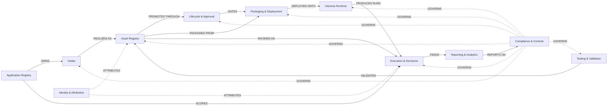
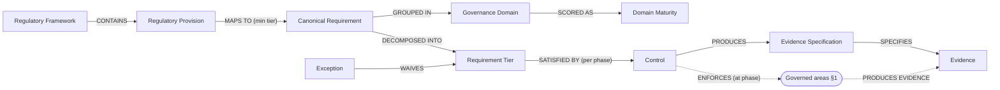
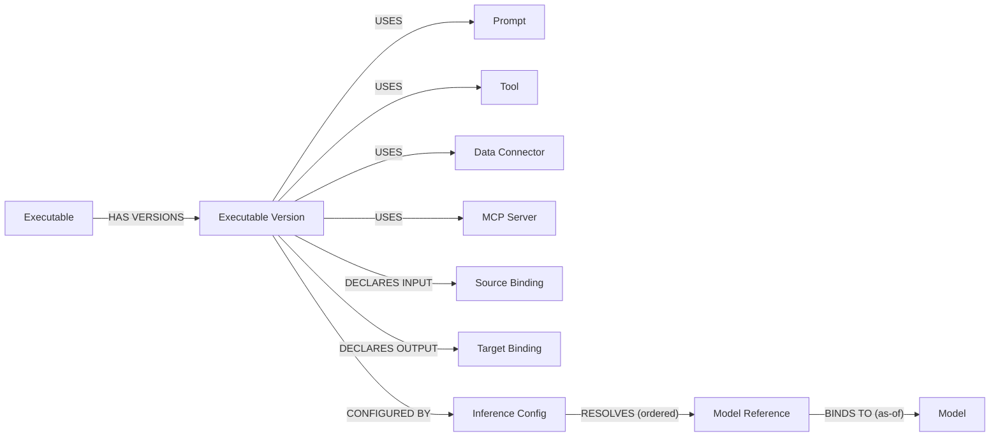
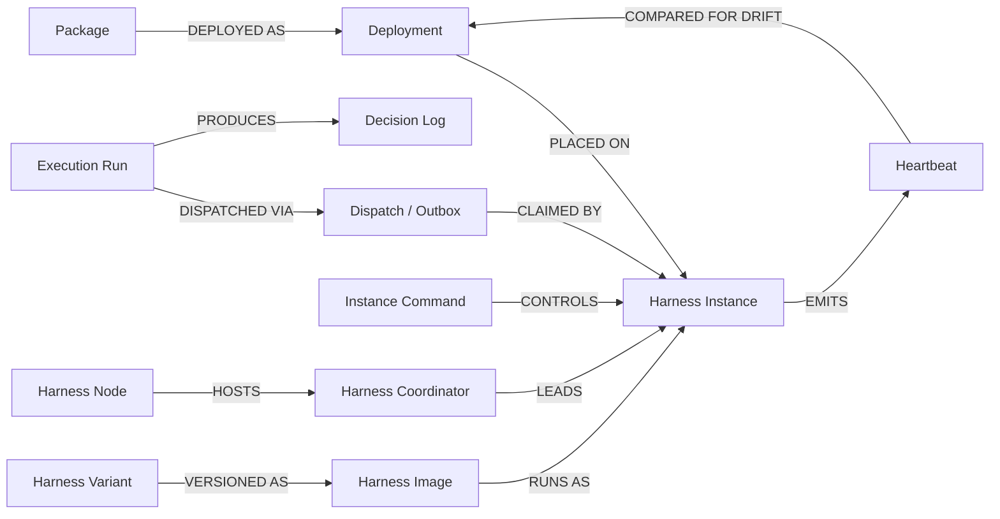

# Verity Conceptual Model — diagram specification

This document defines Verity v2 as a set of **diagrams you can draw**. Each diagram is given
as two tables — **Nodes** (a box: label + the text that goes inside it) and **Edges** (a
labelled line: from → to + the label on the line) — followed by a Mermaid block that renders
the same graph so you can check it. Draw them in any tool; the tables are the source of truth.

It follows the format of the v1 metamodel one-pager (titled box + one-line description +
labelled dashed connectors) and extends it for v2.

**Reading the set.** There is one **top-level diagram** (§1) and three **zoom-ins** (§2–§4)
that expand its denser boxes. Nodes that appear in more than one diagram are **shared** —
they keep the same label, and the zoom-in marks them *(also in §1)*. §5 is the term glossary
that backs the node text; §6 records what changed from v1.

**Two cross-cutting nodes.** **Compliance & Controls** and **Identity & Attribution** touch
*every* other node. In the tables their edges are listed in full; when drawing, render each
as a **band/layer that spans all the other nodes** (a swimlane), not a single box trailing a
dozen arrows. Compliance is generic — it governs and gathers evidence from *all* areas, not
from intake.

---

## 1. Diagram 1 — Verity v2 metamodel (top level)

The replacement for the stale v1 one-pager: the major areas and how a use-case flows through
them, with compliance and identity as cross-cutting bands.

### Nodes

| ID | Label | Text (goes inside the box) |
|----|-------|----------------------------|
| A1 | **Application Registry** | Business applications that own use-cases. Every production run and decision is scoped to an application; app-teams hold roles per application. |
| A2 | **Intake** | The front door. Registers a use-case with its business description, its **functional requirements** (what the AI should do), and an **AI risk / materiality** classification. The classification informs which compliance controls apply. |
| A3 | **Asset Registry** | The versioned model of *what the AI is*: agents and tasks as governed **executable versions**, assembled from reusable components (prompts, tools, connectors, MCP) and declarative input/output **bindings**, pointing at stable **model references**. |
| A4 | **Lifecycle & Approval** | Promotes an executable version through six governed states (`draft → candidate → staging → challenger → champion → deprecated`) under named approvals and sign-offs. Exactly one **champion** at a time. |
| A5 | **Packaging & Deployment** | Builds a champion version into a signed, self-describing **package** (`.vax`/`.vtx`), then governs its **placement** onto a cluster in a run-mode (live / shadow / ab). Being champion ≠ being deployed. |
| A6 | **Harness Runtime** | The distributed fleet that executes packages. Harness instances — led by a per-cluster coordinator — claim dispatched runs, heartbeat health and their running-package catalog, and accept control commands. **Drift** = running vs intended. |
| A7 | **Execution & Decisions** | Each run produces the immutable **decision log** — the complete, queryable record of every AI invocation — plus model-invocation/token usage and human-in-the-loop overrides. |
| A8 | **Testing & Validation** | Structured test suites, ground-truth datasets, evaluation/validation runs and metric thresholds; governance incidents and model-card review. |
| A9 | **Compliance & Controls** | The governance backbone: regulatory frameworks → stable **canonical requirements** (in governance domains, tiered) → **controls** + **evidence specifications**. **Controls govern every area; evidence is gathered from every area.** *(Determining which obligations apply, via ontology + reasoners, is a later phase — see §6.)* |
| A10 | **Identity & Attribution** | One unified **actor** model — humans (Entra) and automation (the harness) — behind every recorded action, with platform-wide and per-application roles. |
| A11 | **Reporting & Analytics** | Compliance and operational reports, run as async jobs against an external, customer-portable analytics store — never on the live execution path. |

### Edges

| From | To | Label |
|------|----|-------|
| A1 | A2 | OWNS |
| A2 | A3 | REALIZED AS |
| A3 | A4 | PROMOTED THROUGH |
| A4 | A5 | GATES |
| A3 | A5 | PACKAGED FROM |
| A5 | A6 | DEPLOYED ONTO |
| A6 | A7 | PRODUCES RUNS |
| A3 | A7 | INVOKED AS |
| A1 | A7 | SCOPES |
| A8 | A3 | VALIDATES |
| A7 | A11 | FEEDS |
| A11 | A9 | REPORTS ON |
| A9 | A2 · A3 · A4 · A5 · A6 · A7 · A8 | GOVERNS *(one line to each)* |
| A2 · A4 · A5 · A7 · A8 | A9 | EVIDENCE *(one line from each)* |
| A10 | A1 · A2 · A3 · A4 · A5 · A6 · A7 · A8 · A9 | ATTRIBUTES *(one line to each)* |

> Drawing note: the last three rows are the cross-cutting bands. Draw **A9 Compliance** as a
> layer under A2–A8 with a single "GOVERNS ▸ / ◂ EVIDENCE" coupling per box, and **A10
> Identity** as a layer with one "ATTRIBUTES" coupling per box — rather than 9 separate arrows
> each.

### Mermaid

*(Mermaid shows representative dotted edges for the two bands; the Edges table lists them in
full.)*

---

## 2. Diagram 2 — Compliance & Controls (zoom-in)

Expands node **A9**. The three-axis, two-bridge governance model. This is the structure of
*what compliance means*; how it attaches to a specific subject (the obligation set) is the
deferred ontology/reasoner work and is intentionally not modelled here.

### Nodes

| ID | Label | Text |
|----|-------|------|
| C1 | **Regulatory Framework** | A body of regulation (SR 11-7, NAIC, EU AI Act, NIST RMF…) with a validity window. *Left axis.* |
| C2 | **Regulatory Provision** | A citable clause within a framework (citation, jurisdiction, effective date). Versioned as regulations amend. |
| C3 | **Canonical Requirement** | Verity's stable, technology-agnostic statement of what is actually required. The centre of gravity — many provisions across frameworks map onto one, so duties aren't duplicated. *Centre axis.* |
| C4 | **Governance Domain** | A grouping of canonical requirements (e.g. explainability, data quality); the unit of maturity scoring. |
| C5 | **Requirement Tier** | A cumulative maturity rung of a canonical requirement (tier N implies all below). Variable depth per requirement. |
| C6 | **Control** | An enforcement mechanism at a lifecycle **phase** (design-time / deploy-time / static-model / execution), with a type and an enforcement action. *Right axis.* |
| C7 | **Evidence Specification** | Defines the evidence a control must produce (artifact type, produced-by, citable-as). |
| C8 | **Evidence** | The append-only **fact** that a control was satisfied — tied to requirement + tier + phase and the producing entity/run. (Tier-2.) |
| C9 | **Exception** | A time-boxed, approved waiver of a requirement tier, with compensating controls and an expiry. |
| C10 | **Domain Maturity** | Per-domain normalized maturity-score snapshots (trend over time). |

### Edges

| From | To | Label |
|------|----|-------|
| C1 | C2 | CONTAINS |
| C2 | C3 | MAPS TO (min tier) · *Bridge 1* |
| C3 | C4 | GROUPED IN |
| C3 | C5 | DECOMPOSED INTO |
| C5 | C6 | SATISFIED BY (per phase) · *Bridge 2* |
| C6 | C7 | PRODUCES |
| C7 | C8 | SPECIFIES |
| C9 | C5 | WAIVES |
| C4 | C10 | SCORED AS |
| C6 | *governed areas — A2–A8 in §1* | ENFORCES (at its phase) |
| *governed areas — A2,A4,A5,A7,A8 in §1* | C8 | PRODUCES EVIDENCE |

### Mermaid

---

## 3. Diagram 3 — Asset Registry / Compose (zoom-in)

Expands node **A3**: how an executable is composed and how its model is resolved.

### Nodes

| ID | Label | Text |
|----|-------|------|
| R1 | **Executable** | The governed unit, `kind = agent | task` (extensible). Identity only — no version-specific config. |
| R2 | **Executable Version** | An immutable revision. The single thing lifecycle, packaging, deployment, and runs all point at. *(also in §1 as A3's core)* |
| R3 | **Prompt** | A reusable prompt; content lives in its versions. Governed *within* the executable that uses it (no lifecycle of its own). |
| R4 | **Tool** | A capability an **agent** version may call. Versioned. |
| R5 | **Data Connector** | A configured connection to a storage/data backend. Versioned. |
| R6 | **MCP Server** | An external capability provider. Versioned. |
| R7 | **Source Binding** | A declared **input** resolved before the run (e.g. "latest filing PDF"). |
| R8 | **Target Binding** | A declared **output** written after the run (e.g. "rated opinion"). |
| R9 | **Inference Config** | Inference parameters for a version; holds no hard model — points at model references. |
| R10 | **Model Reference** | A stable alias (e.g. `reasoning-primary`) the config points at. Listed in priority order = primary + fallbacks. |
| R11 | **Model** | The actual model in the registry; pricing kept as dated history. |

### Edges

| From | To | Label |
|------|----|-------|
| R1 | R2 | HAS VERSIONS |
| R2 | R3 · R4 · R5 · R6 | USES (assignment) |
| R2 | R7 | DECLARES INPUT |
| R2 | R8 | DECLARES OUTPUT |
| R2 | R9 | CONFIGURED BY |
| R9 | R10 | RESOLVES (ordered) |
| R10 | R11 | BINDS TO (as-of) |

### Mermaid

---

## 4. Diagram 4 — Harness Runtime & Execution (zoom-in)

Expands nodes **A5 / A6 / A7**: how a package gets onto the fleet, how runs are dispatched and
executed, and how drift is detected.

### Nodes

| ID | Label | Text |
|----|-------|------|
| H1 | **Package** | The signed `.vax`/`.vtx` artifact built from a champion version. *(also in §1 as A5)* |
| H2 | **Harness Variant** | An execution-engine kind (e.g. an agentic loop). |
| H3 | **Harness Image** | A variant at a version, identified by an immutable content **digest**. |
| H4 | **Harness Instance** | A running harness container on a cluster: current/desired image, owned/shared scope, status, last-seen. |
| H5 | **Harness Coordinator** | The elected per-cluster leader (a lease; prevents split-brain). |
| H6 | **Harness Node** | A coordinator-eligible host (a pod or VM). |
| H7 | **Deployment** | A package placed on a cluster, pinned to a resolved image, in a run-mode. *(also in §1 as A5)* |
| H8 | **Heartbeat** | Instance → portal: health (frequent) + the running-package catalog (periodic) → drift detection. |
| H9 | **Instance Command** | Portal → instance control (patch / drain / disable / reload…). |
| H10 | **Execution Run** | A governed run of a version; state is event-sourced. *(also in §1 as A7)* |
| H11 | **Dispatch / Outbox** | Transactional outbox: the run and its dispatch message commit together; a relay publishes to NATS; an instance claims it. |
| H12 | **Decision Log** | The immutable per-invocation record produced by a run. *(also in §1 as A7)* |

### Edges

| From | To | Label |
|------|----|-------|
| H1 | H7 | DEPLOYED AS |
| H2 | H3 | VERSIONED AS |
| H3 | H4 | RUNS AS |
| H6 | H5 | HOSTS |
| H5 | H4 | LEADS |
| H7 | H4 | PLACED ON |
| H4 | H8 | EMITS |
| H8 | H7 | COMPARED FOR DRIFT |
| H9 | H4 | CONTROLS |
| H10 | H11 | DISPATCHED VIA |
| H11 | H4 | CLAIMED BY |
| H10 | H12 | PRODUCES |

### Mermaid

---

## 5. Glossary

The terms used in node text, defined once.

- **Use-case** — a business problem to solve with AI; registered at **Intake**, realized by
  one or more executables.
- **Executable / Agent / Task** — the governed, versioned, runnable unit. *Agent* = multi-step,
  may use tools; *task* = single LLM step. New kinds can be added without redesign.
- **Executable version** — a frozen revision; everything points at a *version*, never the
  abstract executable.
- **Component** — a reusable piece used inside a version (prompt, tool, data connector, MCP
  server); versioned, but governed through its executable, with no lifecycle of its own.
- **Binding** — a declared input (**source binding**) or output (**target binding**) the
  runtime resolves.
- **Model reference** — a stable alias an executable points at; resolves to an actual **model**
  via a dated binding, so models swap centrally without re-promotion; listed primary + fallbacks.
- **Lifecycle / Champion** — the six governed states; champion is the one approved in-production
  version; deprecated is restorable.
- **Run-mode** — live (full traffic) / shadow (inputs only, outputs suppressed) / ab (scoped
  sample) / locked (no execution).
- **Package / Deployment** — the signed artifact built from a champion; a deployment is that
  package *placed to run*. Champion ≠ deployed.
- **Harness / instance / coordinator / node / drift** — the runtime fleet; a running container;
  the elected per-cluster leader; an eligible host; running-vs-intended mismatch.
- **Decision log / Evidence / HITL override** — the immutable invocation record; an append-only
  proof a control was met; a human field-level correction on a decision.
- **Regulatory framework / provision** — external regulation and a citable clause within it.
- **Canonical requirement** — Verity's stable, technology-agnostic statement of what is
  required; many provisions map onto one.
- **Tier / Governance domain** — a cumulative maturity rung of a requirement; a grouping of
  requirements that is the unit of maturity scoring.
- **Control / Control phase** — an enforcement mechanism; *phase* = when it fires (design-time,
  deploy-time, static-model, execution).
- **Evidence specification / Exception** — what evidence a control must produce; a time-boxed
  approved waiver of a tier.
- **Actor** — the one identity (human or automation) every recorded action is attributed to.
- **Tier-1 vs Tier-2** — authoritative relational system-of-record vs high-volume append-only
  logs (export-bound, not FK targets).

---

## 6. What changed from the v1 metamodel — and what's deferred

The v1 one-pager had seven boxes (Application Registry, Asset Registry, Lifecycle & Approval,
Execution & Decisions, Testing & Validation, Compliance, Policies & Controls). v2 keeps the
shape and changes three things:

1. **Intake (A2) is new** — v1 had no front door for registering a use-case, its functional
   requirements, and its risk/materiality classification.
2. **Harness Runtime (A6) is new** — v1 ran in-process; there was no fleet, no
   deployment-vs-champion distinction, and no drift detection.
3. **Compliance (A9) is reshaped and made cross-cutting** — v1 mapped "canonical requirement →
   product feature" and treated review as periodic. v2 models "regulatory → canonical →
   controls + evidence" (Diagram 2) and draws compliance as a **band that governs every area
   and gathers evidence from every area** — not an intake step.

**Deferred (intentionally not in these diagrams).** *Which* canonical requirements apply to a
given subject, at which tier — the **obligation set** — and the mapping of captured artifacts
to obligations are knowledge-and-inference problems to be handled by an **ontology + reasoner**
layer in a later phase. Until then, treat compliance's linkage as generic (controls govern /
evidence is gathered), and do not bind obligations to any single area in the conceptual model.
